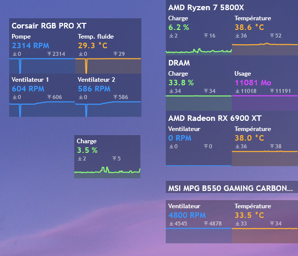

# tiny_dashboard
Tiny rainmeter dashboard inspired by Corsair iCUE.

1. Download and install **HWiNFO64** 
2. Follow the tutorial to set ip up with rainmeter : https://docs.rainmeter.net/tips/hwinfo/ 
3. Open a terminal and type ```reg query HKEY_CURRENT_USER\SOFTWARE\HWiNFO64\VSB``` to get indexes values
4. Update indexes values in **@Resources/indexes.ini**

